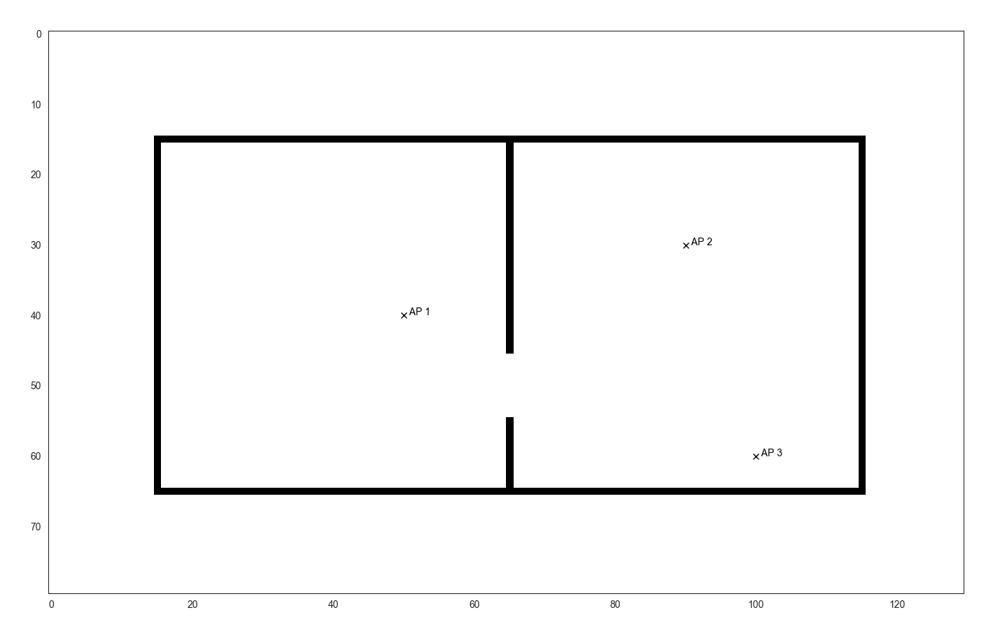
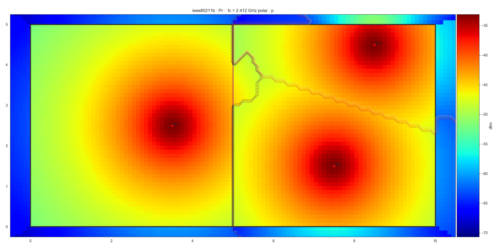
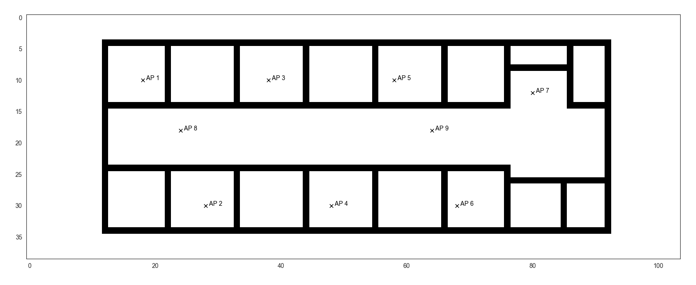
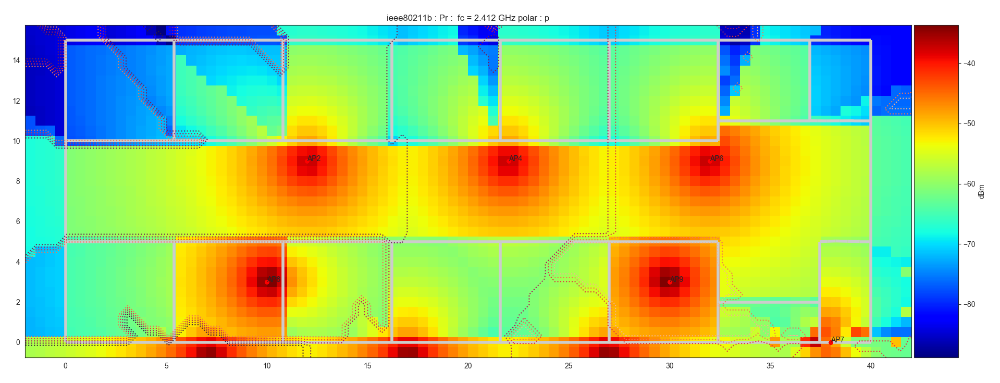
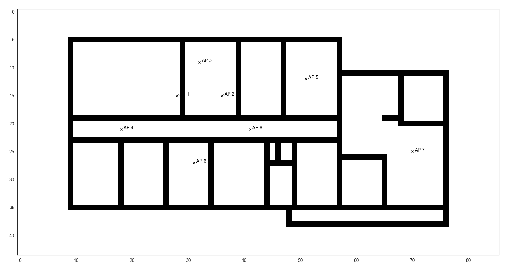
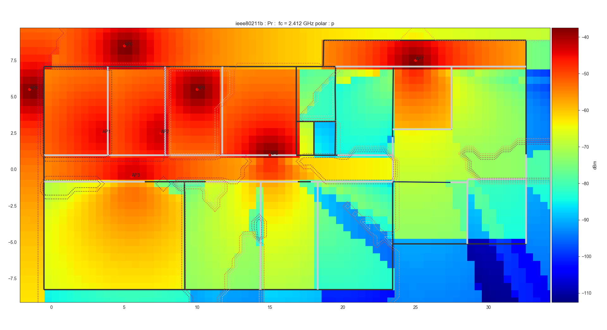
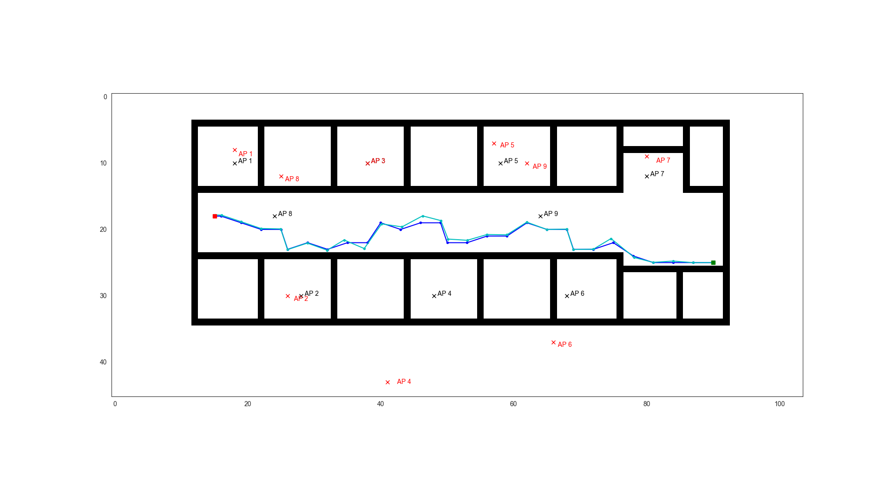
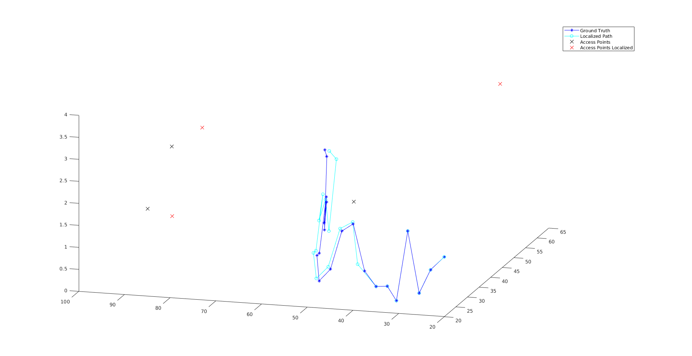

# Radio Inertial SLAM
This branch contains the Python Simulator for Radio-Inertial Localization with support for Pytorch, Keras and ROS. The MATLAB Simulator for the same can be found on the ```matlab``` branch of this repository. The requirements for running the simulator are as follows:

## Requirements
1. Python 3.6
2. Tensorflow/Keras or Pytorch
3. [PyLayers](http://pylayers.github.io/pylayers/)

## Citation
If you use this work (paper or code), or draw inspiration from it, please cite the authors as follows:
```
@inproceedings{Dhanjal_2019,
   title={DeepLocNet: Deep Observation Classification and Ranging Bias Regression for Radio Positioning Systems},
   url={http://dx.doi.org/10.1109/IROS40897.2019.8967767},
   DOI={10.1109/iros40897.2019.8967767},
   booktitle={2019 IEEE/RSJ International Conference on Intelligent Robots and Systems (IROS)},
   publisher={IEEE},
   author={Dhanjal, Sahib Singh and Ghaffari, Maani and Eustice, Ryan M.},
   year={2019},
   month=nov }
```

## Installation
Install Anaconda 3 and proceed with installing Pylayers as per their [manual](https://github.com/pylayers/pylayers/blob/master/INSTALL.md). Once installed, copy and paste all the ```*.ini``` files from the [```assets/inis```](assets/inis/) folder into the ```pylayers_project/ini/``` directory created by the Pylayers installation script. The directory defaults to```~/pylayers_project/ini/``` on Ubuntu. Since pylayers can be tricky to setup, I've attached my anaconda environment in [```pylayers.yml```](pylayers.yml). Commit [```6bbd9c5```](https://github.com/pylayers/pylayers/tree/6bbd9c58bc46e9e8df6d4d41a5b1635e142f91b2) worked best for me.

# Simulation
## Maps
Several different environment maps have been created for testing out the implementation. Some of them are as attached below:
### Defstr Layout
 
### Office Layout
 
### Home Layout
 

## 2-Dimensional Environment
The *blue path* is the **ground truth** generated by the random walk algorithm, whereas the *cyan* one is the **localized path**. The red square specifies the goal location and the green square the start location. Actual positions of the **access points** are encoded in *black*, whereas those **localized** are encoded in *red (only in Fast SLAM)*. The results shown below for 2D localization are in the [`office environment`](assets/results/map2.png).

| Experiment | Algorithm | Classifier Used (Y/N) | Hard/Soft Classification (H/S) | Localization MSE |
| ------------- |:-------------:| :-------------:| :-------------:| :-------------:|
| 1 | Particle Filter | N | N/A | 112.0796
| 2 | Particle Filter | Y | H | 9.2236
| 3 | Particle Filter | Y | S | 9.5589
| 4 | Fast SLAM | N | N/A | 139.1380
| 5 | Fast SLAM | Y | H | 5.8676
| 6 | Fast SLAM | Y | S | 5.2759

The images for all results can be found in the [`/assets/results/2D/`](./assets/results/2D/) folder.The result for Fast SLAM using Hard Classification is as follows:


## 3-Dimensional Environment
As in the previous case, the *blue path* is the **ground truth** generated by the random walk algorithm, whereas the *cyan* one is the **localized path**. Actual positions of the **access points** are encoded in *black*, whereas those **localized** are encoded in *red (only in Fast SLAM)*. The results shown below for 3D localization are in the [`defstr environment`](assets/results/map1.png).

| Experiment | Algorithm | Classifier Used (Y/N) | Hard/Soft Classification (H/S) | Localization MSE |
| ------------- |:-------------:| :-------------:| :-------------:| :-------------:|
| 1 | Particle Filter | N | N/A | 134.8262
| 2 | Particle Filter | Y | H | 52.4851
| 3 | Particle Filter | Y | S | 55.9874
| 4 | Fast SLAM | N | N/A | 116.1535
| 5 | Fast SLAM | Y | H | 12.5777
| 6 | Fast SLAM | Y | S | 11.0179

The images for all results can be found in the [`/assets/results/3D/`](./assets/results/3D/) folder.The result for Fast SLAM using Hard Classification is as follows:

