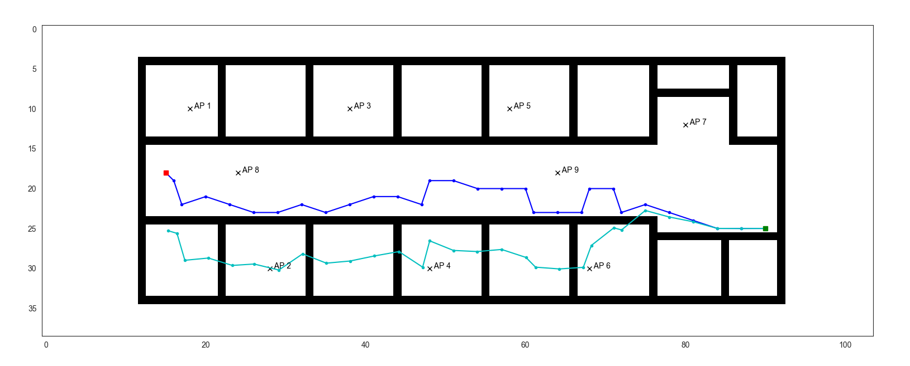
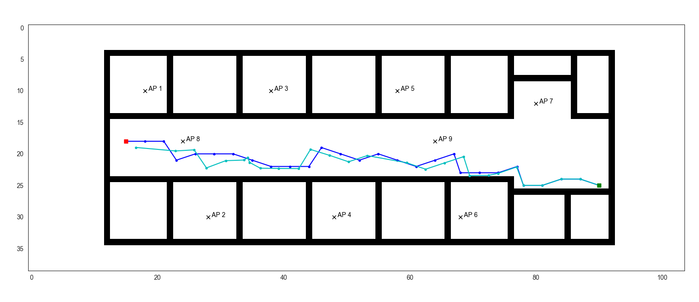
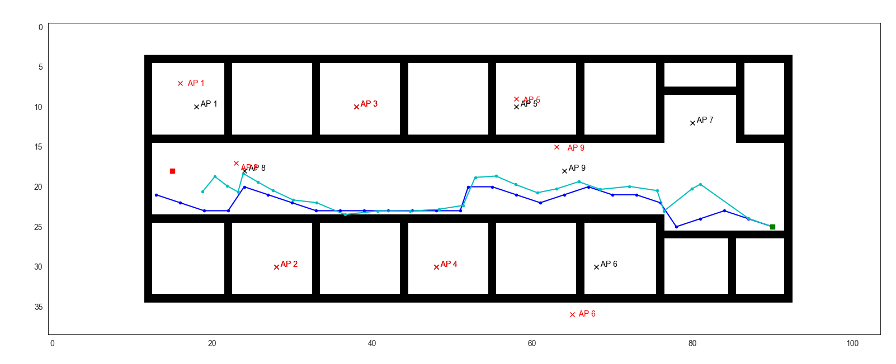

# Radio Inertial SLAM
This branch contains the Python Simulator for Radio-Inertial Localization with support for Pytorch, Keras and ROS. The MATLAB Simulator for the same can be found on the ```matlab``` branch of this repository. The requirements for running the simulator are as follows:

## Requirements
1. Python 3.6
2. Tensorflow/Keras or Pytorch
3. [PyLayers](http://pylayers.github.io/pylayers/)

## Installation
Install Anaconda 3 and proceed with installing Pylayers as per their [manual](https://github.com/pylayers/pylayers/blob/master/INSTALL.md). Once installed, copy and paste all the ```*.ini``` files from the [```assets/inis```](assets/inis/) folder into the ```pylayers_project/ini/``` directory created by the Pylayers installation script. The directory defaults to```~/pylayers_project/ini/``` on Ubuntu. Since pylayers can be tricky to setup, I've attached my anaconda environment in [```pylayers.yml```](pylayers.yml). Commit [```6bbd9c5```](https://github.com/pylayers/pylayers/tree/6bbd9c58bc46e9e8df6d4d41a5b1635e142f91b2) worked best for me.

# Simulation
## Maps
Several different environment maps have been created for testing out the implementation. Some of them are as attached below:


## Coverage
The coverage simulated for different environments and Access Point numbers/locations are as follows:


## 2 Dimensional Environment
### Results with/without Classifier
The *blue path* is the **ground truth** generated by the random walk algorithm, whereas the *cyan* one is the **localized path**. The red square specifies the goal location and the green square the start location. Actual positions of the **access points** are encoded in *black*, whereas those **localized** are encoded in *red (only in Fast SLAM)*

**Particle Filter** - The localization using particle filtering can be seen in the following 2 images. The first one doesn't use the classifier, whereas the second one uses perfect information (*agent knows when the signal is LOS/NLOS*). The **MSE** in the first case was **195.67**, whereas it was **43.81**



**Fast SLAM v1** - All APs are detected in both cases because of the sensing range of the agent. The MSE in the the first case is **54.62** whereas that in the second case is considerably less at **4.35**.


